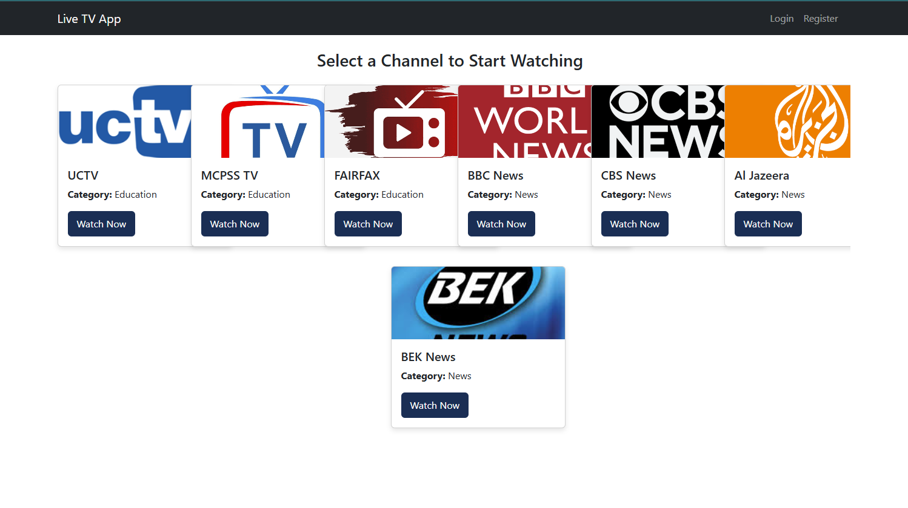
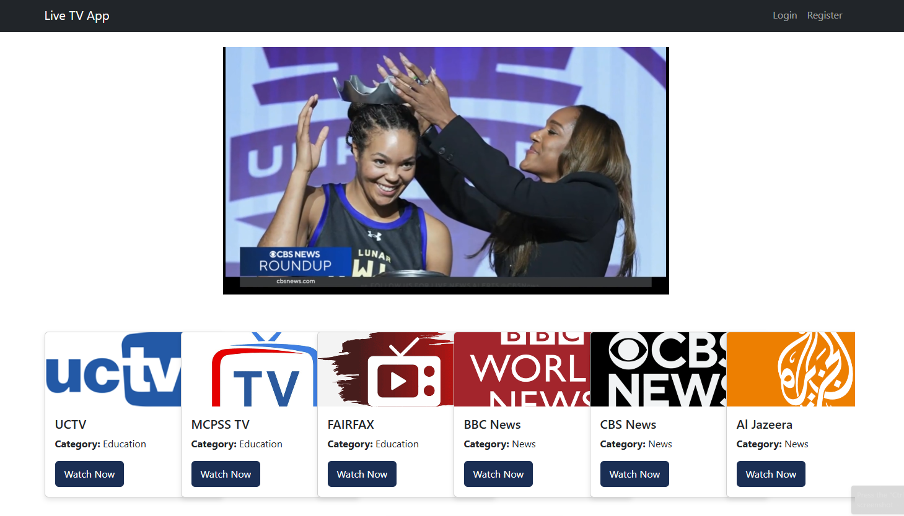

## Live TV App for English Learning

This is a **Live TV App** designed for English learners and IELTS candidates. The app provides access to various educational and university TV channels to help users improve their English through listening and watching. The app is free to use and is meant to support students by providing easy access to valuable content.

---

## **Vision**

The goal of this app is to provide users with a collection of **live TV channels** dedicated to learning English, watching educational content. It is completely **free to use** and open-source, allowing anyone to benefit from it.

---

## **Features**

- **Live TV Streaming**: Access to various educational and university TV channels.
- **Two-Minute Watch Limit**: Users can watch videos for 2 minutes before being prompted to log in. After two minutes, the homepage is blurred to prevent further interaction until login.
- **Channel List**: Users can browse through the list of channels and select the one they want to watch.
- **Video Player**: Uses **Video.js** to stream the live content with a customizable and user-friendly interface.
- **Responsive Design**: The app is responsive, ensuring it works seamlessly on both desktop and mobile devices.

---

## **Tech Stack**

- **Frontend**:

  - React.js
  - Redux Toolkit
  - Bootstrap (for responsive design)
  - Axios (for API calls)
  - Video.js (for video streaming)

- **Backend**:
  - Node.js
  - Express.js
  - MongoDB
  - Mongoose
  - JWT

---

## Live link

[View Here](https://live-tv24.netlify.app/)

## **Setup Instructions**

### 1. **Clone the Repository**

Clone the repository to your local machine:

```bash
git clone https://github.com/Rakibul-Islam-GitHub/live-tv-app.git
```

## Project Structure

/live-tv-app

#### frontend

    /src
      /components
      /pages
      /redux
      /assets
      App.js
      index.js
    /public
    /node_modules
    package.json
    .env

#### backend

    /models
    /controllers
    /routes
    /middleware
    server.js
    .env
    package.json

<!-- [server repo](https://github.com/Rakibul-Islam-GitHub/live-tv-API) -->

---

## Screenshot




## Useful resources

- [React - Doc](https://reactjs.org/)
- [React Router - Doc](https://reactrouter.com/web)
- [ExpressJs - Doc](https://expressjs.com/)

---

## Author

- Linkedin - [Rakibul Islam](https://linkedin.com/in/rakibul21)
